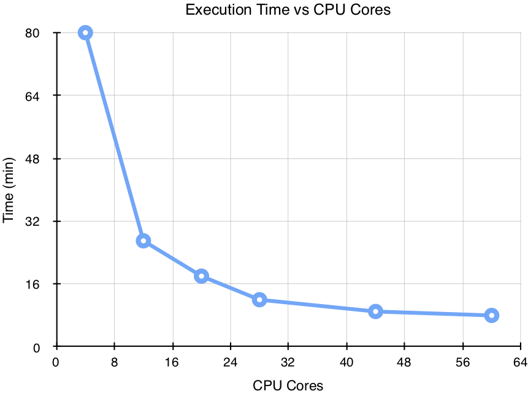

# RasterFrames: Enabling DataFrame-Based Analysis of Big Spatiotemporal Raster Data

_Simeon H.K. Fitch_  
_VP of R&D_  
_Astraea, Inc._  

DataFrames are the _lingua franca_ of of data science. There's a long,
millennia-long history of organizing data in tabular form. Typically, rows
represent independent events or observations, and columns represent measurements
from the observations. The forms have evolved, from hand-written agricultural
records and transaction ledgers, to the advent of spreadsheets on the personal
computer, and on to the creation of [R Data Frames][R] and [Python
Pandas][Pandas]. This table-oriented data structure remains a common and
critical component of organizing data across industries, and is the mental model
employed by many data scientists across diverse forms of modeling and analysis. 

The evolution of the tabular form continues in the introduction of Apache Spark
SQL, which brings DataFrames to the big data distributed compute space. Through
several novel innovations, Spark SQL enables interactive and batch-oriented
cluster computing without having to be versed in the highly specialized skills
in high-performance computing. As suggested by the name, these DataFrames are
manipulatable via standard SQL, as well as the more general-purpose programming
languages Python, R, Java, and Scala.

RasterFrames®, an incubating Eclipse Foundation LocationTech project built on
Spark SQL, brings together Earth-observing (EO) data analysis, big data
computing, and DataFrame-based data science. It is necessary because the recent
explosion of EO data from public & private satellite operators presents both a
huge opportunity & challenge to the data analysis community. It is Big Data in
the truest sense. While EO & GIS specialists are accustomed to working with this
data, it is typically done so at a much less expansive or global perspective.
RasterFrames makes interactive analysis possible on these large data sets
without sacrificing accessibility.

## Architecture

RasterFrames is not only built on Spark SQL, but also most of the other
LocationTech projects: [GeoTrellis](https://geotrellis.io/),
[GeoMesa](https://www.geomesa.org/), [JTS](https://github.com/locationtech/jts),
& [SFCurve](https://github.com/locationtech/sfcurve).


RasterFrames introduces a new native data type called `tile` to Spark SQL. A
"RasterFrame" is any DataFrame with one or more columns of type `tile`. A `tile`
column typically represents a single frequency band of sensor data, such as
"blue" or "near infrared", discretized into regular-sized chunks. Along with
`tile` columns there is typically a `geometry` column specifying the location of
the data, the map projection of that geometry (`crs`), and a `timestamp` column
representing the acquisition time.


Raster data can be read from a number of sources. Through the flexible Spark SQL
DataSource API, RasterFrames can be constructed from collections of (preferably
Cloud Optimized) GeoTIFFs, GeoTrellis Layers, and from an experimental catalog
of Landsat 8 and MODIS data sets on AWS PDS. We are also experimenting with
support for the evolving [Spatiotemporal Asset Catalog (STAC)][STAC].


## Example

The following example will show some of the general operations available in
RasterFrames. In it we will be using the [_MODIS Nadir BRDF-Adjusted Surface
Reflectance Data Product_][NBAR] from NASA, which is directly available in
[Amazon Web Services (AWS) Public Data Set (PDS)][PDS]. We will be using the
RasterFrames MODIS catalog data source, and SQL as our language (as noted above,
Python, Java, and Scala are also options). We will compute the monthly global
average of a [vegetation index][NDVI] in 2017 and see how it varies.

> **Note**: RasterFrames version 0.8.0-RC1 was used in this example.

The first step is to load our MODIS catalog data source into a table and see
what it provides:

```sql
CREATE TEMPORARY VIEW modis USING `aws-pds-modis`;
DESCRIBE modis;
-- +----------------+------------------+
-- |col_name        |data_type         |
-- +----------------+------------------+
-- |product_id      |string            |
-- |acquisition_date|timestamp         |
-- |granule_id      |string            |
-- |gid             |string            |
-- |assets          |map<string,string>|
-- +----------------+------------------+
```

The `assets` column contains a dictionary mapping between band names and a URI
pointing to the GeoTIFF. To determine what bands are available in catalog we can
execute the following:

```sql
SELECT DISTINCT explode(map_keys(assets)) as asset_keys
FROM modis
ORDER BY asset_keys
-- +-------------+
-- |   asset_keys|
-- +-------------+
-- |          B01|
-- |        B01qa|
-- |          B02|
-- |        B02qa|
-- |          ...|
-- +-------------+
```

The next statement reads creates a view representing global red and NIR band
data (arbitrarily) on the 15th of each month in 2017. This will give us 12 

```sql
CREATE TEMPORARY VIEW red_nir_tiles_monthly_2017 AS
SELECT granule_id, month(acquisition_date) as month, 
       f_read_tiles(assets['B01'], assets['B02']) as (crs, extent, red, nir)
FROM modis
WHERE year(acquisition_date) = 2017 AND day(acquisition_date) = 15;
DESCRIBE red_nir_tiles_monthly_2017;
-- +--------+-------------------------------------------------------+
-- |col_name|data_type                                              |
-- +--------+-------------------------------------------------------+
-- |month   |int                                                    |
-- |crs     |struct<crsProj4:string>                                |
-- |extent  |struct<xmin:double,ymin:double,xmax:double,ymax:double>|
-- |red     |tile                                                   |
-- |nir     |tile                                                   |
-- +--------+-------------------------------------------------------+
```

Computing the [normalized difference vegetation index][NDVI] (NDVI) is a very
common operation in EO analysis, and is composed simply as the normalized
difference of the Red and NIR bands from a surface reflectance data product.

<!-- \text{NDVI} = \frac{\text{NIR} - \text{Red}}{\text{NIR} + \text{Red}} -->


Since a  normalized difference is a such common operation in EO analysis,
RasterFrames includes the function `rf_normalizedDifference` for computing it.
For this example we will be just collecting the aggregate statistics (via
`rf_aggStats`) for NDVI on a per-month basis.

```sql
SELECT month, ndvi_stats.* FROM (
    SELECT month, rf_aggStats(rf_normalizedDifference(nir, red)) as ndvi_stats
    FROM red_nir_tiles_monthly_2017
    GROUP BY month
    ORDER BY month
)
-- +-----+---------+-----------+----+---+-------------------+-------------------+
-- |month|dataCells|noDataCells|min |max|mean               |variance           |
-- +-----+---------+-----------+----+---+-------------------+-------------------+
-- |1    |530105436|1261254564 |-1.0|1.0|0.2183160845625243 |0.12890947667168529|
-- |2    |600524070|1213875930 |-1.0|1.0|0.19716944997032773|0.12721311415470044|
-- |3    |615820993|1198579007 |-1.0|1.0|0.20199490649244112|0.12937148422536485|
-- |4    |629659958|1138660042 |-1.0|1.0|0.24221570883272578|0.13896602048542867|
-- |5    |635920714|1074799286 |-1.0|1.0|0.2949905328774185 |0.15610215565162433|
-- |6    |617826616|1092893384 |-1.0|1.0|0.3430829566130305 |0.1768520590388395 |
-- |7    |604436464|1106283536 |-1.0|1.0|0.37280247950373924|0.19128743861294956|
-- |8    |598500660|1169819340 |-1.0|1.0|0.3620362092401007 |0.19355049617163744|
-- |9    |623849120|1190550880 |-1.0|1.0|0.30889448330373964|0.1727205792001795 |
-- |10   |613413505|1200986495 |-1.0|1.0|0.2771316767269186 |0.15228789046594618|
-- |11   |546679019|1244680981 |-1.0|1.0|0.2510236308996954 |0.1348450714383397 |
-- |12   |520511978|1201728022 |-1.0|1.0|0.237714687195611  |0.13236712076432644|
-- +-----+---------+-----------+----+---+-------------------+-------------------+
```

And here's what when get when we plot the mean value:


(While the curve is interesting, interpreting it is beyond the scope of this article.)

## Scalability

As stated in the introdution
This same job was run using multiple cluster sizes. Each custer node was an AWS
`m4.large` configuration, which is composed of 4 virtual cores, 8 GB RAM, and 32
GB HDD.

Nodes | Cores | Memory (GB) | Execution Time (min)
----- | ----- | ----------- | --------------------
4     | 16    | 32          | 27
6     | 24    | 48          | 18
8     | 32    | 64          | 12
12    | 48    | 96          | 9
16    | 64    | 128         | 8



## Conclusion

As we have seen....


## Learning More

In-depth and more sophisticated examples, including clustering and
classification may be found on the RasterFrames website: rasterframes.io.

* [rasterframes.io](http://rasterframes.io)
* [GitHub](https://github.com/locationtech/rasterframes)
* [Jupyter Notebooks](https://github.com/locationtech/rasterframes/tree/develop/deployment)
* [Gitter](https://gitter.im/s22s/raster-frames)

[MODIS]:https://vip.arizona.edu/documents/MODIS/MODIS_VI_UsersGuide_June_2015_C6.pdf
[NBAR]:https://lpdaac.usgs.gov/dataset_discovery/modis/modis_products_table/mcd43a4_v006
[STAC]:https://github.com/radiantearth/stac-spec
[PDS]:https://registry.opendata.aws/modis/
[R]:https://www.rdocumentation.org/packages/base/versions/3.5.1/topics/data.frame
[Pandas]:https://pandas.pydata.org/
[NDVI]:https://en.wikipedia.org/wiki/Normalized_difference_vegetation_index