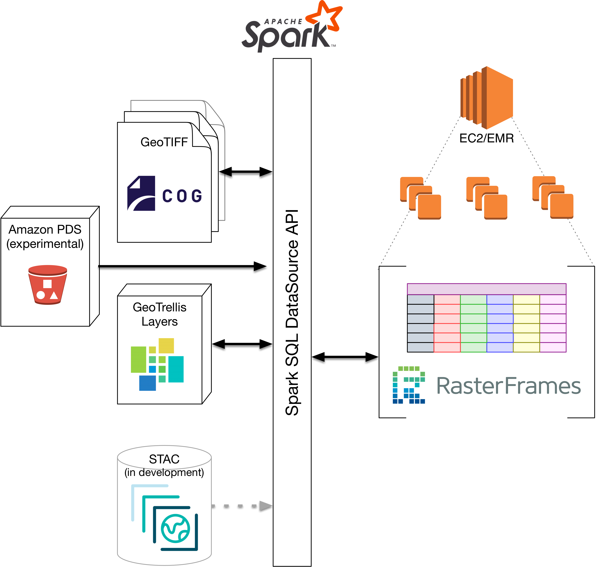

# RasterFrames: Enabling Data-frame-Based Analysis of Big Spatiotemporal Raster Data

_Simeon H.K. Fitch_  
_VP of R&D_  
_Astraea, Inc._  

## Purpose

RasterFrames®, an incubating Eclipse Foundation LocationTech project, bridges
the gap between Earth-observing (EO) data analysis, big data computing, and
DataFrame-based data science. It was created to help data scientists and
analysts fully realize the rich potential of Earth-observing data 

## Background

The recent explosion of EO data from public & private satellite operators
presents both a huge opportunity & challenge to the data analysis community. It
is Big Data in the truest sense. <<stats>> While EO & GIS specialists are
accustomed to working with this data, it is typically done so at a much less
expansive or global perspective.

## Why Data-frames?

Data-frames are the _lingua franca_ of of data science. There's a long history
of organizing data in tabular form, with rows representing independent events or
observations, and columns representing measurements from that observation. From
agricultural records and transaction ledgers, to the advent of spreadsheets, and
on to the creation of R DataFrames and Python Pandas, this table-oriented data
structure remains a common and critical component of organizing data across
industries. This trend continues in the big data compute space with Apache
Spark SQL, which implements compute cluster distributed data frames.

## Architecture

RasterFrames extends the data-frame abstraction for EO data on top of other
LocationTech projects: GeoTrellis, GeoMesa, JTS, & SFCurve. Through it the user
can perform raster analysis in SQL, Python, Java and Scala.

## Data Source Integration

## Example Use Case

A common EO operation is to compute a vegitative index

## Learning More

* rasterframes.io
* Jupyter Notebooks
* GitHub
* Gitter

