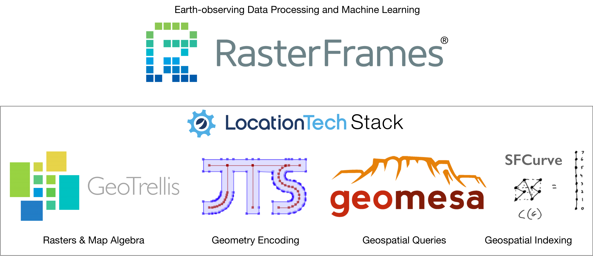
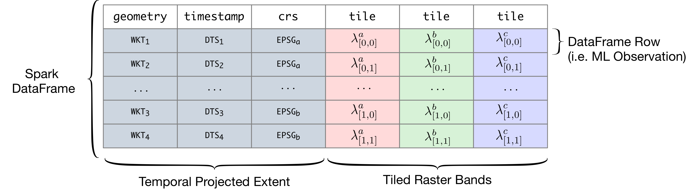

# RasterFrames: Enabling DataFrame-Based Analysis of Big Spatiotemporal Raster Data

_Simeon H.K. Fitch_  
_VP of R&D_  
_Astraea, Inc._  

## Purpose

RasterFrames®, an incubating Eclipse Foundation LocationTech project, brings
together Earth-observing (EO) data analysis, big data computing,
and DataFrame-based data science. It was created to help data scientists and
analysts fully realize the rich potential of Earth-observing data. 

## Background

The recent explosion of EO data from public & private satellite operators
presents both a huge opportunity & challenge to the data analysis community. It
is Big Data in the truest sense. While EO & GIS specialists are
accustomed to working with this data, it is typically done so at a much less
expansive or global perspective. RasterFrames makes interactive analysis
possible on these large data sets without sacrificing accessibility.

## Why DataFames?

DataFrames are the _lingua franca_ of of data science. There's a long history
of organizing data in tabular form, with rows representing independent events or
observations, and columns representing measurements from that observation. From
agricultural records and transaction ledgers, to the advent of spreadsheets, and
on to the creation of [R Data Frames][R] and [Python Pandas][Pandas], this table-oriented data
structure remains a common and critical component of organizing data across
industries. This trend continues in the big data compute space with Apache
Spark SQL, which implements compute cluster distributed data frames.

## Architecture

RasterFrames extends the DataFrame abstraction for EO data on top of other
LocationTech projects: GeoTrellis, GeoMesa, JTS, & SFCurve. Through it the user
can perform raster analysis in SQL, Python, Java and Scala. 

RasterFrames introduces a new native data type called `tile` to Spark SQL. A
"RasterFrame" is any DataFrame with one or more columns of type `tile`. A `tile`
column typically represents a single frequency band of sensor data, such as
"blue" or "near infrared", discretized into regular-sized chunks. Along with
`tile` column is typically a `geometry` column specifying the location of the
data, and a `timestamp` column representing the acquisition time.

Raster data can be read from a number of sources. Through the flexible Spark SQL
DataSource API, RasterFrames can be constructed from collections of (preferably
Cloud Optimized) GeoTIFFs, GeoTrellis Layers, and from an experimental catalog
of Landsat 8 and MODIS data sets on AWS PDS. We are also experimenting with
support for the evolving [Spatiotemporal Asset Catalog (STAC)][STAC].

## Example Use Case

A common EO operation is to compute a vegetative index, with NDVI being the most
common. In this case we're going to be a little more sophisticated and compute
EVI2, as described in the [_MODIS VI Users Guide_][MODIS]:

In this example we will be using the [_MODIS Nadir BRDF-Adjusted Surface
Reflectance Data Product_][NBAR], which is directly available in [Amazon
Web Services (AWS) Public Data Set (PDS)][PDS]. We will be using the RasterFrames
MODIS catalog data source.

## Learning More

* rasterframes.io
* Jupyter Notebooks
* GitHub
* Gitter

[MODIS]:https://vip.arizona.edu/documents/MODIS/MODIS_VI_UsersGuide_June_2015_C6.pdf
[NBAR]:https://lpdaac.usgs.gov/dataset_discovery/modis/modis_products_table/mcd43a4_v006
[STAC]:https://github.com/radiantearth/stac-spec
[PDS]:https://registry.opendata.aws/modis/
[R]:https://www.rdocumentation.org/packages/base/versions/3.5.1/topics/data.frame
[Pandas]:https://pandas.pydata.org/